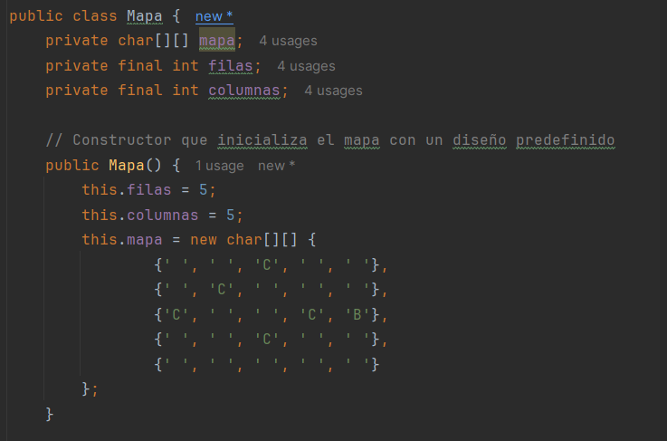

# Practica Calificada 4

Preguntas de Diseño e implementacion:

# Construimos la logica del Juego

Vamos construyendo clase por clase.

• ¿Cómo implementarías la clase Map para representar el mapa del juego, asegurando que se puedan agregar y verificar posiciones de torres y caminos?

# Clase Map

Empezamos creando los atributos y el constructor

Ahora creamos los metodos:

• Implementa un método en la clase Map llamado isValidPosition(int x, int y) que verifique si una posición es válida para colocar una torre.

Con este metodo implementado podemos refactorizar el metodo `insertarTower()`

Ahora vamos con la siguiente clase.

# Clase Enemy

Empezamos por crear los atributos y el constructor.

Ahora los Getters y setters

Ahora crearemos los metodos:

• Diseña e implementa una clase SpeedyEnemy que herede de Enemy y tenga una velocidad mayor pero menos vida.

Ahora crearemos clases derivadas para cada tipo de Enemigo

# Clase Tower

Empezaremos creando los atributos y el constructor.

Ahora crearemos los getters y setters

• ¿Cómo implementarías el método attack(List enemies) en la clase Tower para atacar a los enemigos dentro de su alcance?

Ahora crearemos los metodos 

• Implementa una clase SniperTower que tenga un daño alto y un alcance muy largo pero una velocidad de disparo baja.

Ahora creamos las clases derivadas para cada tipo de Torre:

# Clase Wave

Empezaremos creando los atributos y el constructor.

• ¿Cómo diseñarías la generación de oleadas para que cada oleada sea progresivamente más difícil?

Ahora creamos los metodos:

• Implementa un método en la clase Wave llamado spawnEnemies() que genere los enemigos de la oleada y los coloque en el mapa.

Para implementar este metodo tenemos que hacer una refactorizacion a las clases `Wave`, `Map` y `Enemy` 

En la clase `Wave` se añaden los siguientes atributos

Para la Clase `Map` se añade el siguiente metodo

Para la Clase `Enemy` se añaden los siguientes atributos y sus getters

Y el siguiente setter para devolver la posicion 

# Clase Player

Empezaremos creando los atributos y el constructor.

Ahora creamos los getters:

- ¿Cómo actualizarías la puntuación del jugador y la salud de la base cuando un enemigo es derrotado o alcanza la base?

Ahora creamos los metodos:

# Clase Game

Empezaremos creando los atributos y el constructor.

Ahora creamos los metodos:

Ahora creamos las Interfaces y clases de Mocking:

# Interfaz EnemyFactory

Creamos la interfaz

Creamos las clases:

## Clase BasicEnemyFactory

## Clase FastEnemyFactory

## Clase BossEnemyFactory

# Interfaz TowerFactory

Creamos la interfaz

## Clase CannonTowerFactory

## Clase LaserTowerFactory

## Clase ArrowTowerFactory

